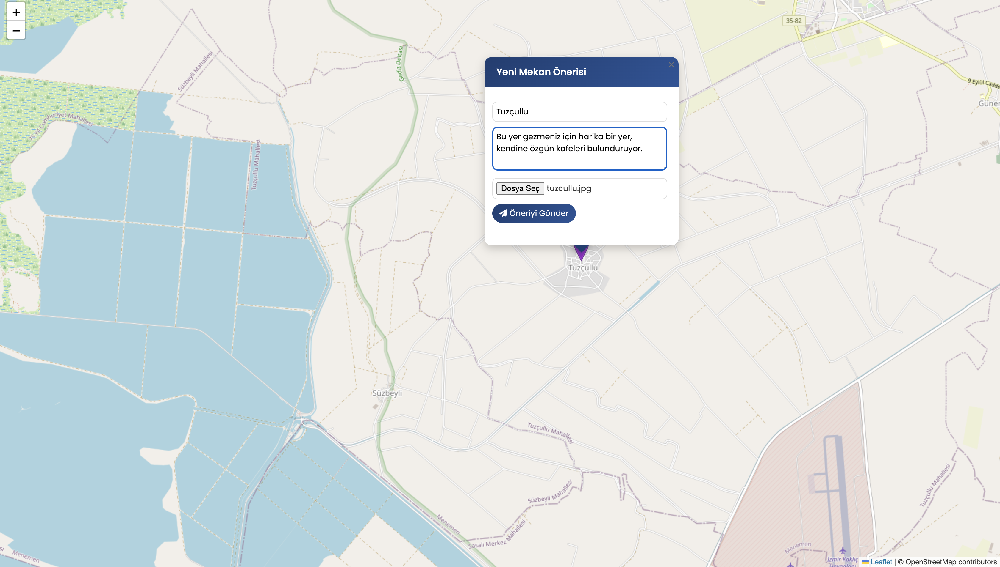

# Gezi Haritası 🌍 / Travel Map 🌍

## Proje Hakkında / About the Project
🇹🇷 Bu proje, kullanıcıların gezi lokasyonlarını harita üzerinde işaretleyebilecekleri, fotoğraf ekleyebilecekleri ve yorum yapabilecekleri bir web uygulamasıdır. Hem Türkçe hem de İngilizce dil desteği sunar.

🇬🇧 This project is a web application that allows users to mark travel locations on a map, add photos, and make comments. It supports both Turkish and English languages.

## Özellikler / Features
🇹🇷
- Harita üzerinde konum işaretleme
- Fotoğraf yükleme ve görüntüleme
- Yorum sistemi
- Admin paneli
- Konum onaylama sistemi

🇬🇧
- Location marking on map
- Photo upload and viewing
- Comment system
- Admin panel
- Location approval system

## Kurulum / Installation
🇹🇷
1. Projeyi klonlayın:
   ```bash
   git clone https://github.com/bariszorlu35/geziharitasi.git
   ```
2. Gerekli klasör izinlerini ayarlayın:
   ```bash
   chmod 777 resimler/
   chmod 777 galeri/
   ```
3. MySQL veritabanında `deneme` adında bir veritabanı oluşturun.
4. `Veritabanı Dosyası` klasöründe bulunan SQL dosyasını veritabanına import edin.
5. XAMPP, WAMP veya benzeri bir web sunucusu kullanın ve proje dosyalarını web sunucusunun kök dizinine kopyalayın.

🇬🇧
1. Clone the project:
   ```bash
   git clone https://github.com/bariszorlu35/geziharitasi.git
   ```
2. Set the necessary folder permissions:
   ```bash
   chmod 777 resimler/
   chmod 777 galeri/
   ```
3. Create a database named `deneme` in MySQL.
4. Import the SQL file located in the `Veritabanı Dosyası` folder into the database.
5. Use a web server like XAMPP or WAMP and copy the project files to the web server's root directory.

## Kullanım / Usage
🇹🇷
1. Ana sayfada harita üzerinde bir konum seçin.
2. Konum bilgilerini ve fotoğraf ekleyin.
3. Admin panelinden konumları onaylayın.
4. Kullanıcılar yorum yapabilir ve fotoğraf ekleyebilir.

🇬🇧
1. Select a location on the map from the main page.
2. Add location information and photos.
3. Approve locations from the admin panel.
4. Users can make comments and add photos.

## Ekran Görüntüleri / Screenshots





## Lisans / License
🇹🇷 Bu proje MIT Lisansı altında lisanslanmıştır. Daha fazla bilgi için [LICENSE](LICENSE) dosyasına bakın.

🇬🇧 This project is licensed under the MIT License. See the [LICENSE](LICENSE) file for more details.
